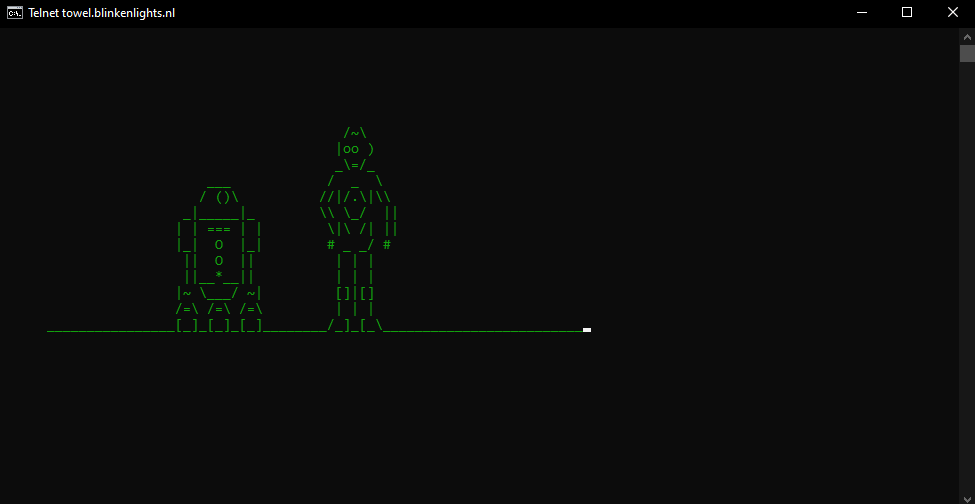

 # 01 Change colors

Text aur background ke color ko change karne ke liye hai ye apne cmd me

```bash
 help color
 ```

isse wo ek dialogue bataayega puura jisme alag alag color code likhea rhega. Uske hisaab se apna color select karo. 

For example, abhi aaya ek green color jiska color code hai 2 aur blue ka hai 1 toh agar baadme kuchh aisa code likhe...

```bash
 color 12
 ```

Toh isme wo background color blue aur text color green karega

 # 02 Changing the prompt

```bash
 help prompt
 ```

Dhyaan se dekho usme dikhega wo greater than sign ke liye __$G__ hai...

```bash
 prompt Kakarot\Downloads$G
 ```

will always prompt __Kakarot\Downloads>__ everytime ha par wo hi section ke liye.

 # 03 Changing the title

```bash
 title Kakarot\System32\cmd.exe
 ```

will change its title to __Kakarot\System32\cmd.exe__

 # 04 Watch Star Wars

Sabse pehle, telnet client ko enable karna padega. Uske do alternatives hai, unme se pehle waala easy padega


### Option A:
 Windows ke search box me _Turn Windows features on or off_ me Telnet client pe tick rhe wo ensure karo pehle.
### Option B: 
_Poweshell_ kholo admin ke taur par aur ye command type karo...

```bash
 Enable-WindowsOptionalFeature -Online -FeatureName "TelnetClient"
 ```

Ye chaalu kar dega apna telnet client.
Abhi jaao cmd me aur ek chhotu sa command type karo

```bash
 telnet towel.blinkenlights.nl
 ```

Thodi der ruko aur phir bataayega star wars... mast lagega wo



Mast dikh rha hai na?

 # 05 Hiding your personal stuffs

Suppose koi ek dhaasu folder hai tumhaara, tum uuse hide karna chahte ho par wo file explorer me option hai ki show hidden files, jisse ki jo hide kiya hai wo bhi dikh sakta hai... Toh abhi cmd use karege toh aisa kuchh nhi hoga... Ha bas problem ye hai ki hume wo folder ka naam yaad rakhna padega.

```bash
 Attrib +h +s +r FileName
 ```

Make sure ki jis directory me tumhaara chal rha hai cmd tumne wo folder waha par hi banaaya ho
Agar wo folder ko waapis unhide karna hai toh usko + ke jagah - karo. Matlab....

```bash
 Attrib -h -s -r FileName
 ```

Isse wo unhide hojaayega

 # 06 Copying output to clipboard

Jo bhi command likhna chahte ho samajh lo jaise apne directory ka output tumhe clipboard me copy karna hai toh usme __| clip__ kardo jaise...

```bash
 dir | clip
 ```

wo abhi uska command ko clipboard me copy kardega.

 # 07 View Command History 

Simply ek __F7__ ka button press karo aur wo section me jitna bhi commands tumne type kiya hoga wo sab display hojaayega.

 # 08 Create Folders with reserved name

Naam jaise _con_ aur _aux_ ke folders nhi ban sakte hai but ek command se hosakta hai

```bash
 md aux\
 ```

ye _aux_ naam ka ek folder bana dega.

 # 09 View Installed Programs

```bash
 wmic product get name
 ```

Ha thoda time lega ye load hone me par ye puura bataayega ki apne system me kitne programs installed hai.
